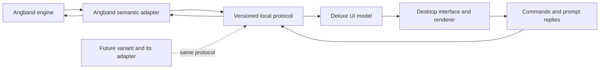

# Angband Deluxe: product and implementation specification

Status: target design. A first Windows development build now implements a subset;
see [implementation status](../deluxe/README.md) and [development protocol 0.1](deluxe-protocol-0.1.md).
Prepared 21 September 2026 from the project brief and the complete conversation
"Enhanced Angband Client Search". The current brief takes precedence over earlier
ideas in that conversation. Updated 22 September 2026 to incorporate the subsequent
implementation decisions below; these supersede conflicting original requirements.

## Current decisions and delivery scope

- Windows is the current implementation and validation target. macOS/Linux remain
  long-term goals; their builds, packaging and native QA are explicitly deferred
  and are not gates for the current milestone.
- Native C/C++ with SDL3, SDL GPU and Dear ImGui is the implemented stack. Python
  is build/test tooling only. Do not use desktop/computer-use automation for this
  project; the user performs hands-on UI testing.
- UI scale is 75–150%, with no High Contrast mode or separate glyph-size slider.
  The complete current gameplay viewport always fits its available area, without
  gameplay scrollbars. This does not imply displaying the entire dungeon level.
- Normal play uses a semantic dungeon viewport with separate terrain, trap, item
  and actor layers. The engine supplies the camera bounds and perceived visuals;
  Deluxe owns rendering and the surrounding character UI. The renderer does not
  crop the terminal or infer entities by parsing its text.
- Capture existing presentation results during ordinary engine drawing. Do not
  call map helpers again from API queries: memory updates and hallucination RNG
  must occur exactly as they do during normal play. Cache invalidation must cover
  level changes, camera changes and new characters. Repeated queries are pure.
- Terminal fallback remains for birth, dedicated recall screens, character sheets,
  knowledge screens, nested selections and post-death interactions. Transitions
  preserve engine input contexts, cursor visibility and confirmations. Removing
  the terminal sidebar from normal play must not remove its useful information:
  rank, progression, resources, stats, armour, speed, conditions, tracked health,
  light, terrain/traps underfoot, level feelings and pending activities belong in
  Deluxe's information panel or existing inventory/equipment views.
- Native look/target interactions use the engine's existing cursor, candidate
  cycling, free movement, camera and projection path. Hover inspects a tile;
  normal left-click uses Angband mouse movement (including adjacent melee).
  Right-click opens Move here / Look / Target actions; Target immediately
  selects an eligible monster or the clicked location without opening a mode; during targeting,
  left-click relocates the cursor without confirming. The Look / Target tab offers confirmation, cancellation and cycling.
  Aim-direction prompts also retain the dungeon, with keyboard direction input
  or click-to-target. Engine checks and confirmations remain authoritative;
  projection paths are not promises of damage, hit chance or spell area effects.
  Dedicated monster/object recall may still use terminal fallback. Inspection
  reads existing snapshots and does not issue gameplay commands on hover.
- Main menu contains Characters, an inline right-aligned New character button,
  and save rename/delete actions. Ask for the save name when creating a character.
  No title banner, explanatory boilerplate, messages or gameplay side panels.
  Messages and side panels remain hidden throughout character creation.
- Save and… offers continue, return to main menu, and quit. Normal completion of
  death returns to the main menu after the engine's post-game flow. HP bars clamp
  at zero and must never become indeterminate indicators. System notices use
  the regular messages panel with a `[SYSTEM] ` prefix, not dismissible banners.
- Character information stays fixed while the tabbed panel scrolls independently.
  HP/SP/Food use red/blue/green bars; Food includes percentage and numeric value.
  The messages panel has a draggable height divider and inline expandable search.
  No redundant gameplay status strip or "click here for keyboard play" message.
- Inspection includes full engine descriptions and applicable actions; boolean
  flags use ticks/crosses. Empty inscriptions do not create blank tooltip lines.
  Actual properties may be exposed and used, with no "show actual properties"
  checkboxes or mandatory player-knowledge entitlement boundary.
- Settings is a staged modal with Graphics, CRT effects and Animations tabs.
  Cancel discards changes; Save and Close commits them. Fullscreen and UI scale
  live under Graphics. CRT has scope, tube/strength presets, raster/mask choices
  and independent component switches/sliders. CRT is already implemented and
  accepted, not deferred work. Low Health Animation and Combat feedback are
  independent. Death proceeds directly to the summary. Shader strength is invisible
  at zero and intentionally strong at maximum, with moderate presets.
- The red Dev tools menu contains an explicit damage dialog. Debug mutations are
  separate from normal gameplay commands, validated at legal engine boundaries,
  and use normal damage/death handling. They do not redefine game balance.
- Cross-platform backend packages, alternate-variant conformance, complete native
  birth flows, advanced spell-area previews, controller support and screen-reader validation
  remain future work, not claims about the current prototype.

## 1. Product intent

Angband Deluxe is a Windows, macOS and Linux desktop front-end for Angband and,
eventually, other Angband variants that implement the same semantic API. Angband
continues to own the rules, simulation, character progression, randomness,
knowledge, command execution and save format. Deluxe makes existing information
and commands easier to use and understand.

The fork exists to add an adapter and front-end integration points. Do not rewrite
or redesign the core library. Prefer existing hooks; any indispensable new hook
must be a small, behaviour-preserving change with parity tests. Gameplay changes
are outside this project, even when they appear convenient for the new interface.

The intended compatibility promise is: install a compatible backend package for
the current operating system, select it in Deluxe, and play without rebuilding or
changing Deluxe. An arbitrary existing Angband executable does not automatically
implement this contract. Saves remain specific to their engine and version.

## 2. Non-negotiable requirements

1. The same engine build, starting state, RNG state and player actions produce
   the same gameplay outcomes through the classic and Deluxe interfaces.
2. API queries, tooltips, sorting, resizing and rendering consume no game time,
   change no knowledge, use no gameplay RNG and never mutate the live simulation.
3. The backend may expose actual engine state, including information hidden from
   the player. Player knowledge is metadata, not an API access restriction.
   The front-end decides which information to display or use for presentation.
4. All gameplay actions pass through the engine's existing command handling,
   including costs, restrictions, inscriptions, confirmations and interruptions.
5. Keyboard play remains fast and complete. Mouse and controller actions use the
   same semantic commands. Cosmetic animation never gates the next input.
6. Engine-specific rules and calculations stay in the backend adapter. The client
   consumes data, descriptions, capabilities and action descriptors.
7. The existing front-ends and native savefiles remain usable. Deluxe settings
   and supplementary history are stored separately from engine saves.

Actual state, player-known state, remembered observations and current perception
are distinct. A bonus unknown to the character may still have an exact value in
the API. Reading that value must not identify the item in the simulation.
Unavailable to the adapter and unknown to the player are also distinct states.

## 3. Architecture

### Backend boundary

Use one child process per active game, communicating over standard input/output
with a versioned, UTF-8 JSON Lines protocol. Standard error carries diagnostic
output. No network listener or service is required. This avoids exposing native
struct layouts, pointers, compiler ABIs or the engine's global state to Deluxe.
It also lets a variant implement the contract in its own language and build.

The first backend lives in this repository and links the existing C engine.
Keep serialization and transport separate from the semantic adapter so
both can be tested independently. An in-process interface can be added later;
it is not the compatibility contract.

Keep simulation on a single engine thread. Input hooks can block that thread
while awaiting a protocol reply, while the separate client remains responsive.
Queries during a prompt read immutable published snapshots. No background thread
may call arbitrary engine functions or inspect mutable globals.

### Client boundary

Separate connection/package handling, semantic models, commands, widgets and
rendering. Client production code must not include Angband engine headers or
assume its inventory size, equipment slots, class list, stat count, depth units,
spell system, damage formula or enum ordinals.

The implemented client uses C++, SDL3, SDL GPU and Dear ImGui, with semantic
glyph rendering and terminal fallback. These are client choices, not API dependencies.
SDL documents its GPU abstraction and Dear ImGui supplies SDL3/SDL GPU backends:
[SDL GPU](https://wiki.libsdl.org/SDL3/CategoryGPU),
[Dear ImGui backends](https://github.com/ocornut/imgui/blob/master/docs/BACKENDS.md).
Backend availability alone does not establish screen-reader support or complete
desktop usability; test those separately before committing to the widget layer.

## 4. Information availability and presentation

The API is permitted to expose hidden information without requiring an inspection,
pickup, identification or other player action first. This applies generally, not
only to facts available through a free look action. No per-field exception or
special spoiler/debug mode is required merely because a fact is hidden.

Expose actual values alongside player-knowledge and perception metadata, with
separate observed/remembered values where they differ. The front-end can then
choose how to use them. Transporting information does not itself require Deluxe
to show it, and future uses need not be anticipated before allowing API access.

| Domain | API may expose | Useful accompanying context |
| --- | --- | --- |
| Player | Actual stats, equipment contributions and status durations | Character-screen values and learned sources |
| Items | True identity, curse/artifact/ego status, value and modifiers | Known identity/properties, appearance and current visibility |
| Monsters | True race, exact HP, abilities and actual position | Perceived identity, visibility, displayed health band and learned recall |
| Map | Actual terrain, hidden traps, secret doors and unseen occupants | Explored/remembered terrain, detection and perception |
| Spells | Engine effect parameters and actual-state calculations | Player-facing descriptions and calculation assumptions |
| Events | Full paths, areas, source/target identities and resolved damage | Which segments and participants were perceived |
| History | Actual events and identities, including previously hidden facts | What was known at the event and what was learned later |

For example, the backend may expose that a floor item is cursed before the player
has looked at or picked it up. Deluxe may use that value for a curse effect. The
API need not establish that a free inspection would already reveal it. This does
not mark the item as identified, execute look/pickup or change any item mechanics.

Hallucination, blindness, mimics and detection still need accurate metadata so the
client can distinguish actual state from perceived appearance. Exact monster HP,
unidentified properties and unseen geometry are all legitimate API data; their
on-screen use is a front-end product choice, not a protocol prohibition.

The initial ordinary panels can retain familiar player-known views. Deliberate
uses of additional information, including visual effects, remain supported.
Choosing those views does not impose filtering on other API consumers or require
them to use the same disclosure policy. API completeness can grow incrementally;
permission to expose data is not a requirement to serialize the entire engine.

Previews declare whether they use actual or player-known state, and distinguish
calculated estimates from resolved outcomes. Queries must not advance the live
simulation or consume its RNG to determine future results. Unchanged gameplay
means unchanged rules and simulation for equal actions; it does not require equal
information presentation or imply that richer presentation cannot help decisions.

## 5. Quality-of-life requirements

The following are product scope. Milestones sequence delivery; they do not
silently drop features. Each feature is enabled only when its backend capability
is present. Disabled features have an understandable explanation.

| Feature | Required behaviour | Acceptance condition |
| --- | --- | --- |
| Inventory, equipment and quiver | Search/filter/sort views, clear backend-defined slots, keyboard selection, context actions; optional drag/drop maps to wield/takeoff/drop | Sorting changes only the view; a selected item remains correct after reorder; confirmations and turn costs match classic play |
| Item comparison | Compare a candidate against an explicitly chosen occupied slot; damage, stats, speed, resistances and effects with an explicit calculation basis | Comparison changes no live equipment, RNG, engine knowledge or turn; two rings and multi-slot replacements are unambiguous |
| Rich inspection | Hover, focus or select items, monsters, terrain, spells and statuses for descriptions and properties | All inspection works without a mouse; the client chooses which actual and observed properties to present |
| Character dashboard | Resources, stats, armour, speed, depth, statuses, resistances and sources | Familiar values match character screens; additional actual-state details remain distinguishable |
| Targeting | Target cycling, mouse selection, trajectories/range, beam and area previews where supported | Actual targeting uses engine rules; previews declare actual/known-state basis and do not claim random outcomes are certain |
| Knowledge browser | Search and filter monsters, uniques, objects, artifacts, egos, runes, spells and discoveries | The initial learned-information view filters results, counts and sort keys consistently; the API can also supply undiscovered records |
| Message history | Scroll/search/filter, engine message categories, repeat counts, warning emphasis, sequence and known turn labels | Critical engine acknowledgements remain required; old messages without known turns are labelled as such; no fabricated timestamps |
| Command palette | Search named commands and applicable items/spells, then collect required arguments | "Cast phase door" resolves an available spell and follows ordinary validation; ambiguous matches require selection |
| Keybindings and macros | Searchable configuration, context-aware conflicts, classic and roguelike presets, import/export, profiles | Equivalent commands produce equivalent actions; macros retain engine interruption and confirmation behaviour |
| Context actions | Applicable commands on objects, creatures, doors and stairs | The client chooses which supplied details to show; commands still undergo normal engine validation |
| Character creation | Data-driven race/class/stat selection, explanations, consequences and keyboard navigation | Uses existing birth commands, restrictions and random rolls; inspecting an option never rerolls |
| Stores and other selections | Search/sort stock and options, clear quantities/prices, keyboard navigation | Engine validates price, stock and affordability at execution; stale selection cannot buy another object |
| Map and minimap | Known-map view with optional stairs, objects, traps and creature layers | The initial known-map view uses observation data; actual-state data remains available for other presentation uses; level changes invalidate old data |
| Accessibility | Scalable UI/fonts (75–150%), non-colour cues, reduced motion, remapping and visible keyboard focus; no High Contrast mode | Core flow is keyboard complete and usable at all offered scales; screen-reader feasibility is tested before claiming support |
| Saves and profiles | Character selection, backend/version labels, save metadata, settings profiles, optional captured thumbnails | Saves are routed only to compatible engines; import does not overwrite the original; sidecars cannot alter gameplay state |
| Run history | Milestones, uniques, artifacts, depth progression, equipment changes and death/victory summary | Distinguish actual events from what the player knew; older runs may have incomplete history; sidecar loss does not prevent loading the native save |
| Mouse/controller | Point/select/context actions and remappable controller navigation | Neither is required; focus and menu transitions cannot accidentally spend a turn |
| Presentation settings | Font/UI scale, ASCII/tile choice where assets exist, sound volume/mute, animation speed including instant | Settings do not change engine timing or decisions; animations can be skipped without swallowing the triggering command |

Inventory filters follow the chosen front-end view. Context menus are conveniences, not a
replacement rules engine: attempting a generally available action can still
fail normally and spend a turn when the engine's rules require it.

No new automatic tactical decisions, engine-side auto-identification, auto-healing,
auto-equipping, pathfinding advantages, difficulty changes or altered generation
are part of this specification. Existing engine automation may be exposed as
existing commands with its existing stop conditions.

### Deferred presentation and optional extensions

GPU CRT effects and health/death glitches are implemented presentation features.
Particles, animated creatures, broader lighting, spatial ambience, theme packs
and new art remain optional future presentation work. Their hooks must preserve
engine timing, input responsiveness and the existing semantic boundary.
Cloud synchronization, deterministic replay, web/mobile clients and a general
mod marketplace are separate future projects. Screen-reader support is a desired
outcome, gated by real assistive-technology validation rather than a toolkit claim.

## 6. Variant installation and compatibility

A backend package contains a manifest, a platform-native executable, its runtime
dependencies, game data, licences and optional presentation assets. The manifest
declares stable engine identity, engine version, protocol ranges, package format,
platform/architecture, launch path and save compatibility identifier. Executable
and asset paths are relative to the package; extraction rejects traversal paths.

Dragging a package or selecting a folder registers it. Registration reads metadata
without running the engine. Selecting Play launches that engine and negotiates
the actual capabilities; the manifest is not a substitute for the handshake.
Import, version mismatch, missing dependency and startup failure produce useful
messages. Packages are executable software; process separation is not a sandbox.

Keep saves, settings and history in writable user directories, namespaced by
engine identity and save compatibility. Never write runtime data into installed
application bundles. Updating a package must not replace active-game binaries or
silently migrate saves. Multiple installed versions can coexist.

The first conforming implementation is this Angband fork. A second, deliberately
different mock backend must demonstrate unusual slots/stats/commands and missing
optional capabilities without any engine-specific client patches. A real second
variant is a later integration, not a launch prerequisite or an implied commitment
to modify FrogComposband or ZAngband now.

## 7. Repository integration findings

Inspected baseline: `167ba295d8ed2971aa53891cea0d9cf2a92c6333`, labelled Angband
4.2.6 by the README. This fork already includes commands such as explore and
navigation. Do not equate its README version with proof of upstream gameplay
identity. Parity first means this exact engine with and without the adapter;
audit pre-existing differences separately before advertising vanilla equivalence.

| Existing integration surface | Intended use and caution |
| --- | --- |
| `src/game-event.h` | Subscribe to state invalidations, lifecycle and effects; copy pointer-backed payloads and preserve perception metadata |
| `src/cmd-core.h` | Translate public command IDs and arguments into the existing queue; do not expose internal enum ordinals |
| `src/game-input.h` | Bridge item/spell/direction/quantity/text/check requests into correlated prompts without rewriting command implementations |
| `src/player.h` | Map actual and knowledge-aware state into distinct semantic values |
| `src/cave-map.c` | Study existing visibility/memory rules; `map_info()` can memorize squares and consume RNG during hallucination, so it is not a pure query |
| `src/ui-display.c` | Reference health bars and visible status semantics alongside exact engine values |
| `src/obj-info.h` | Reuse pure descriptions/calculations; label player-known, actual and template data distinctly |
| `src/player-calcs.c` | Support known-only and actual-state comparisons; prove purity and use isolated hypothetical state |
| `src/player-history.h` | Export actual identities with known-event flags and discovery timing |
| `CMakeLists.txt`, `src/tests/` | Add optional backend/client targets and adapter tests while preserving existing builds |

Audit each reused helper for mutation, RNG consumption and actual/known semantics.
Do not solve comparison by temporarily swapping the live equipment or solve map
queries by repeatedly driving the terminal renderer. Capture an existing
presentation result where appropriate, or extract a demonstrably pure helper.
Fallback terminal frames can preserve unusual menus during development; semantic
widgets must never derive their data by parsing those frames.

## 8. Delivery sequence and release gates

### M0: contract and feasibility

Finalize the companion protocol design, field-level provenance and fixtures.
Validate process launch and round-trips on Windows now; defer macOS/Linux checks.
Test UI scaling, keyboard focus, text input and assistive-technology options.
Inventory helpers that need new pure accessors. Record a clean baseline build.

Exit: a written contract, executable protocol fixtures, a mock backend and a
chosen client stack. These are design/transport tools, not a playable release.

### M1: first playable API-backed client

Implement backend handshake, lifecycle, immutable snapshots, commands, prompts,
save/load and terminal fallback. Deliver a plain dungeon view with character,
inventory/equipment, messages and known-monster inspection panels. Add basic
palette search, context actions, scaling and keyboard configuration.

Exit: create a character, enter town/dungeon, move, fight, use items, handle a
prompt, save, close and reload through Deluxe on Windows. macOS/Linux validation
is deferred by the current brief. Demonstrate
actual/known-state separation and parity for these flows. Label remaining fallback menus.

### M2: complete semantic QoL

Add comparison, targeting previews, knowledge browser, native birth/store/spell
and item selection, minimap, advanced bindings/macros, profile/save management
and run reports. Complete mouse support and controller navigation. Remove reliance
on fallback menus for the standard supported Angband play flow.

Exit: every QoL row above has its acceptance checks, or an explicit backend
capability limitation visible in the UI. Unsupported advertised capabilities
are defects, not a reason to leave a button inert.

### M3: compatibility and distribution

Publish the adapter guide and conformance suite; exercise the alternate mock
backend. Package and smoke-test Windows releases first; macOS/Linux packaging
and validation are a later milestone. Exercise
spaces/non-ASCII characters in installation and save paths. Test package upgrades,
missing assets, incompatible saves and a backend crash. Retest classic front-ends.

Exit: installable packages, tested platform matrix, dependency/licence inventory,
versioned contract and accurate feature/support documentation. Operating-system
minimums and supported CPU architectures are set from tested builds, not guessed.

### M4: aesthetic overhaul

Use the semantic state, perception metadata and events for the visual/audio treatment discussed
in the original chat. Art direction is intentionally left open for the next brief.

## 9. Validation strategy

- **Gameplay parity:** replay equal semantic actions against equal initial game
  and RNG states using classic-input and API-input paths. Compare normalized
  simulation state, RNG state, turn/energy, inventory, outcomes and saves. Exclude
  wall-clock metadata, but do not ignore gameplay differences as "UI effects".
- **Read purity:** repeat all queries, comparisons and previews; open/close panels,
  filter and resize; assert no change to simulation, knowledge, RNG or energy.
  Include hallucination and failed/invalid queries.
- **Actual/known-state separation:** paired fixtures differ only in hidden facts;
  actual-state outputs reflect the difference while player-known views remain
  accurate to their stated basis. Include curses, mimics, invisible monsters,
  hidden walls/traps and remembered locations. Verify a curse effect can use an
  uninspected item's actual value without changing engine identification state.
- **Command parity:** confirmations, inscriptions, cancellations, failed actions,
  rest/run interruptions, repeated commands, full inventory and stale handles.
- **Transport:** negotiation mismatch, malformed/oversized frames, duplicate
  request IDs, broken pipes, lost delta revisions and child termination.
- **Compatibility:** unknown optional fields, absent capabilities, different
  equipment layouts and namespaced custom actions on the mock backend.
- **Desktop QA:** user-performed Windows keyboard/mouse checks at 75–150% UI
  scale, reduced motion and focus restoration. No computer-use automation.
  macOS/Linux native QA and controller validation are deferred.
- **Responsiveness:** on a declared reference machine, target cached UI response
  within 50 ms and local protocol overhead below 20 ms at the 95th percentile,
  excluding engine processing. Measure before fixing a release performance bar.

Conformance checks data semantics, provenance and non-mutating reads; it does not
require concealing hidden engine state. Native package tests cannot be replaced
by a successful Windows build alone.

## 10. Decisions still to resolve during implementation

The product boundary, cross-platform requirement, unrestricted information access and
unchanged gameplay are fixed requirements. These implementation details need
evidence from M0: widget toolkit/accessibility integration, minimum OS/GPU targets,
how much terminal fallback is needed, pure comparison accessors, known-map preview
support and packaging/signing tooling. None requires a change to game balance.

The protocol and backend compatibility details are specified in
[the companion API design](deluxe-api.md).

### Gameplay preferences

Settings includes a Gameplay tab with Proceed with click (default off).
When enabled, a left-click in the game view acknowledges a pending - more -
message. The same click never also moves or targets. Other prompts and UI
controls are unaffected. The option is persisted only on Save and Close;
Cancel discards the draft.

Gameplay also offers Click exits look (default off). When enabled, a left-click
on a tile during Look exits Look and sends that click through the normal
engine movement/attack handler, preserving its world location and modifiers.
Combat targeting and aim prompts retain tile selection. Save and Close applies
and persists the preference; Cancel discards it.

Ground-item context menus offer Pick up for displayed items, including memory
and hallucinations. The backend uses engine
pathfinding to approach, a normal final walk, then ordinary pickup. Monsters,
other interruptions, failed arrival, level changes or Escape cancel the intent;
it never resumes later. Existing pickup capacity checks and pile prompts remain.

Remembered pickup attempts do not require current sight or an actual object
at the remembered location. If nothing remains on arrival (or the image was
a hallucination), the trip simply ends without picking anything up.

The dungeon context menu groups Move here, contextual actions, and Look/Target
with separators. Contextual actions include Pick up, Tunnel for remembered
diggable walls/rubble (excluding permanent rock), Disarm for known active traps,
Open/Close for doors, and Go up/Go down for stairs. Trap and door actions approach
an adjacent square and run the original engine command with its normal repeat
count, skill checks and confusion rules. Interrupted travel cancels the action.
Hover cards include engine-provided click hints that account for adjacency,
confusion, trap immunity, visible occupants and the mouse-movement option.
Terrain actions share interruption-safe travel: tunnelling approaches an
adjacent passable tile; stairs are used after arriving on their tile. The
original engine commands retain digging attempts, tools, turns and stair rules.

Movement-direction prompts (including T) keep the native dungeon clickable
and feed clicks into the original engine direction handler. Context-menu Tunnel
continues until the hole is made or normal engine interruption/futility stops
it; exhaustion of a repeat batch alone does not abandon the requested dig.

### Native item selection

The ordinary Items tab remains a unified inventory/equipment view. Starting
Quaff, Read, Use, Fire, Throw or another item command opens a native selector
containing only eligible items, with location, quantity and full inspection
text. Double-click, arrows/Enter and unique engine letter shortcuts select;
Cancel/Escape returns without performing the action. Original engine quantity
and inscription confirmations follow normally. Item-first actions use the
same commands and eligibility rules. Dungeon presentation remains visible.

Dev tools includes Quit without saving. It closes the backend and Deluxe
without writing the current session, preserving the most recent existing save.
Loading a regular save is read-only. Unsaved progress is intentionally discarded.

### Native stores and Home

Entering a shop opens stock and player belongings side by side, with quantities,
engine unit prices, full inspection descriptions and comparisons against the
corresponding equipped items (including both occupied ring slots). Your inventory
shows only items the current shop can accept. Its heading always includes the
player's current gold, including in no-selling games. The store/owner heading
replaces the stock heading. Leave sits beside Buy
(or Retrieve at Home), and the no-selling explanation is a Give-button tooltip.
Buy and Sell/Give invoke the existing store flow: eligibility, inscriptions,
quantity limits, carrying capacity and exact total-price confirmations remain
engine-owned. A no-selling character sees Give and receives no gold. Home uses
the same interface with Store/Retrieve and no prices. Leave/Escape returns to
the dungeon. Transaction messages remain visible in the store.
The optional store UI hook leaves the original terminal store unchanged for
other frontends. Knowledge-menu shop recall still uses terminal fallback.

### Native spell browsing, study and casting

Spellcasting characters have a Spells tab listing readable books in their pack
or on their current tile. Each book shows all its spells, with engine-provided
level, mana cost, current failure chance, learned/forgotten status, description
and available effect summary. Castable and learnable spells are distinguished;
unavailable entries remain inspectable. Hovering/browsing costs no turn and
does not consume gameplay randomness. Shops and Home allow inspection of the
spells in readable stock books before purchase/retrieval.

Cast and Study feed the original engine commands. Book inscriptions, prerequisites,
low-mana warnings, targeting and follow-up prompts remain authoritative. Low mana
does not disable casting: Angband's confirmation still permits overexertion.
Classes that choose spells select a specific spell; classes that learn randomly
use Study book and retain the original random choice. Ordinary keyboard casting,
study and book browsing use native book/spell prompts, including eligible-only
selection, letter shortcuts, arrows/Enter and cancellation. The dungeon stays
visible behind native spell choices. Birth and unrelated recall/knowledge screens
remain terminal fallbacks; a native character sheet is subsequent work.

### Quick targeting

Gameplay settings includes Quick targeting (off by default, staged until Save
and Close). When enabled, a left click during an aimed action or combat targeting
selects the clicked monster/location and immediately resumes the original action.
This applies to casting, shooting, throwing and other actions using the shared
aiming flow. Look-mode selection and movement-direction prompts keep their
existing behaviour. Engine range, effect and subsequent confirmation checks
still apply. A cosmetic connector runs from the player's cell to the near edge
of the active targeting box; it is distinct from the engine's projection path.

Aim-direction prompts immediately show a mouse-following targeting box and
edge connector, before entering a separate targeting mode. With Quick targeting
enabled, the first click at that preview resumes the aimed action. Hover is
client-only and neither selects an engine target nor consumes a turn.

### Compact character overview

The fixed sidebar overview groups character identity and resources, dungeon context, and the tracked creature into distinct sections. Identity shares a compact wrapping row with a Details button, which opens the original character screen until a native sheet replaces it. HP/SP and Food/XP use a two-column bar layout; food retains both percentage and amount. XP shows progress within the current level using engine-supplied level_start_experience and next_level_experience thresholds, with exact totals in a tooltip. Attributes occupy equal-width columns; gold, armour, speed, depth, light and feeling use aligned cells. Creature names are capitalized for display. The overview remains outside the scrolling tab panel.

### Native character sheet

Details and the Character command open a read-only native modal with Overview, Combat & skills, Resistances & abilities, and Background tabs. The existing keyboard terminal sheet remains available. The engine exposes player.character_sheet containing grouped label/value/color rows shared with its original character screen, stat breakdowns, known effective resistance levels and ability descriptions, and background history. No terminal scraping or client combat calculations are used. Closing with Escape, Close, or the window close control returns focus to the game; browsing sends no gameplay command. This supersedes the interim Details button opening the original sheet.

### Structured inspection descriptions

Items retain their legacy description and also expose description_sections with stable id, title, and text fields. Sections are emitted directly by the engine description generators in the same calculation: origin/lore, curses, bonuses/damage, resistances/protection, durability, abilities, use/activation, combat, digging, and notes. Empty sections are omitted. Inventory and store inspection use collapsible headings, initially expanding gameplay effects and combat while collapsing lore, durability and digging. Numeric combat breakdowns within these sections remain engine-authored prose; the client does not parse or recalculate them.

### Native item combat cards

Item combat_details are emitted alongside the original description from the same engine calculation. Rows have kind, label, value, str and dex fields: blows/upgrade values use hundredths of a blow; damage/throw_damage and damage_variant/throw_variant use tenths of damage; range is feet and break is percent. Warning and note rows preserve qualifications such as heavy weapons and off-weapon brands. Native inspection replaces combat prose with metric tiles, an STR/DEX upgrade table, and conditional target damage rows; tooltips explain units and alternatives. The original full description remains unchanged for fallback clients.

### On-demand equipment comparison

The item.compare capability accepts a current item handle and snapshot revision. The engine returns a whole-character preview for each compatible equipment slot, including both ring slots; stale requests are rejected. Computation uses known bonuses and the same melee damage helpers as inspection. Hypothetical slots, weight, derived states, and RNG are restored before responding. Replaced items remain carried; external items add one item of weight. Cursed/removal-blocked slots are marked hypothetical. Metrics include melee damage and attack rate, ranged bonuses/rate, armour, speed, carried weight, and attributes; resistances, flags, brands and slays identify gains/losses. Unknown melee dice omit the damage estimate rather than fabricating one. This is not an equip action.

Inventory and store inspection request the preview only while expanded, cache it for the snapshot revision, and discard stale replies. The UI offers replacement-slot selection, Current/Selected/Change columns, and an option to show unchanged secondary stats. No per-movement bulk comparison calculations are added.

### Native item rules and inscriptions

Inventory item context menus distinguish Ignore this item from Ignore item kind, with matching undo actions. Eligibility follows the original ignore menu; engine ignore processing, protected inscriptions and equipped-item drop confirmations remain in force. Item rules opens a native review/removal panel for individual ignored items, kind rules, quality thresholds, ego rules, and aware/unaware auto-inscriptions. The item.rules capability uses item.preferences, item.rules.list and item.rules.clear with current revision validation for mutations.

Inscribe continues through Angband's original command and confirmation path, with a native editor showing the current inscription, Save/Cancel, and hover help for common tags. Auto-inscribe this kind opens a separate editor: saving updates the engine kind rule and applies normal auto-inscription to carried items, preserving existing notes; blank removes the rule without deleting existing inscriptions. These are character preferences saved through the normal save system, not changes to game balance.

## Quick-action bar (September 2026)

Gameplay settings include an optional Quick-action bar, disabled by default and
applied only by Save and Close. Ten compact slots reserve a row beneath the
playing dungeon, above the resizable Messages panel. Birth, stores and the main
menu omit the bar. It does not cover or crop the dungeon.

Click a slot or use physical top-row 1 through 0. Numpad movement is unchanged.
No modifier bindings are included. Shortcuts apply only during ordinary play
with game keyboard focus; prompts, targeting, message acknowledgement, text
fields and pop-ups retain normal input. Held shortcuts fire once and their text
events cannot leak into the resulting prompt.

Right-click items, spells or commands to assign an action to a numbered slot.
Right-click a slot to assign, replace or clear it. Items use small category
symbols; spells and other actions use monograms, with full names in tooltips.
Item counts or spell mana costs appear on slots. Unavailable bindings remain
visible, dimmed, with a tooltip explaining why.

Assignments persist per save in Deluxe preferences and follow successful save
renames; deleting a save removes its profile. Bindings store engine-provided
opaque item binding_key values and action/spell identities, never revision-scoped
item handles. Each activation resolves a fresh eligible carried item or equipped
item. Consumables recover when a matching stack is reacquired. Wearable identity
includes its kind, ego/artifact and bonuses; changed equipment may need rebinding.
Engine category metadata supplies presentation hints. These fields are additive;
backends lacking binding keys still support command slots.

All activations use the existing command API, including engine checks,
inscriptions, confirmations, low-mana warnings and targeting. There are no macro
sequences or automatic confirmations. No gameplay rules are changed.

Quickbar assignment menus omit empty categories and item action submenus. Occupied
slots offer Customize above Clear: automatic or chosen category icons, custom
text/symbols, and a colour picker with preview. Save and Close persists the
appearance per slot; Cancel discards edits. Appearance never changes the action.

Custom quickbar labels use the available slot width and wrap before shrinking,
with reserved space for shortcut and quantity indicators. Customize groups
artwork under Icon, with a visual picker; saved icon choices remain compatible.

## Native character creation (September 2026)

The Windows client opts into interaction.birth when launching a character.
Creation uses five native steps: Race, Class, Attributes, Identity and Review.
Selections show engine-supplied modifiers, skills and ability descriptions,
with a live preview. Narrow windows stack the preview beneath the controls.
Point buy exposes remaining points, costs, refunds, reset and suggested allocation.
Random rolling supports re-roll and previous-roll restoration. Identity includes
an editable name and background. Birth options remain available throughout.
A previous-character shortcut is available when the engine permits quickstart.
Begin adventure accepts the character through ordinary engine birth commands;
Return to main menu cancels without creating a save. Gameplay panels and quickbar
remain hidden during creation. The starting funds preview is before outfit costs.

The adapter implements an optional birth UI hook, not new gameplay rules.
State includes a structured birth record; birth.action and birth.cancel require
the current revision and an active creation boundary. Race/class IDs, stat IDs,
name limits and birth-option choices are validated. Engine events supply point
costs and totals; state queries do not generate rolls or mutate the character.
Clients without the capability retain terminal creation. Existing commands and
save formats remain unchanged. macOS/Linux packaging remains deferred.

## Dungeon interaction feedback (September 2026)

Hovering during ordinary unmodified mouse play previews the engine's walking
route as a continuous amber line through tile centres. The optional interaction.route capability provides
read-only dungeon.route queries, checked against the current input context.
Queries are throttled, limited to one in flight, and never set the client's
command-busy flag. Stale replies are discarded. The path is advisory: normal
movement still stops for danger, objects and other engine interruptions.

Mouse movement and travel-and-act intents emit travel.changed feedback with a
destination, level identity, activity label and active/interrupted state. The
client records specific travel failures in regular [SYSTEM] messages. Travel
activity and completion have no ribbon or queued-destination marker. Feedback
does not resume interrupted travel or bypass checks.

Message pauses replace the small corner '- more -' text with a centred dark
ribbon near the bottom of the dungeon: an amber pause emblem, 'Messages waiting',
a wrapped excerpt, gentle breathing accents and a faint viewport border.
Height follows measured message and hint wrapping, with a clear gap between
them. The ribbon grows upwards; excerpts exceeding the available viewport
height are clipped on whole lines with an ellipsis. The
Messages heading also displays WAITING. White filled blocks are avoided for CRT
readability. Existing acknowledgement keys remain authoritative, and clicking
continues only when Proceed with click is enabled. No messages are auto-skipped.

The ribbon fades to 10% opacity while hovered and never captures clicks.
Underlying dungeon interactions and Proceed with click retain their normal rules.

## Native knowledge browser (September 2026)

Knowledge opens immediately left of Settings during play. Its modal browser has
Creatures, Items, Artifacts and Terrain tabs, case-insensitive search, category
filters, coloured entry names and independently scrolling list/detail panes.
Recall is grouped into collapsible sections, with creature sighting/kill counts.
Close and Escape restore game focus. The native Commands entry also opens it;
backends without the knowledge capability retain the classic command.

The optional knowledge:1 capability supplies knowledge.list({category}) and
knowledge.get({category,id}). Lists return category and entries with numeric id,
name, group and color. Details return those fields plus stats (label/value) and
description_sections (id/title/text). IDs are engine/session-local. Unknown
categories, unavailable IDs and noninteger IDs are rejected; queries require
a character in the playing phase. Queries neither spend turns nor change
tracking, gear or random-number state. They are requested only while browsing,
never added to movement snapshots. Stale selection replies are discarded and
read-only replies cannot release an outstanding gameplay command.

This browser presents discovered monster lore, item-type recall (including
unidentified flavours), seen artifacts and terrain definitions. Descriptions
come from the engine's lore and object-info routines, not scraped terminal text.
These presentation choices do not restrict the API's broader ability to expose
actual or hidden properties. macOS/Linux packaging remains deferred.

Knowledge records also include known (boolean). The Known only checkbox defaults
to enabled and hides unidentified item types; disabling it includes their
flavours. Item names include their type (e.g. Bronze Ring). Item colours use
Angband display attributes, with black replaced by readable white.

## Status-effect overview (September 2026)

Active effects appear as compact wrapping badges directly beneath resources.
Harmful effects come first (red), followed by mixed effects (amber) and benefits
(green). Explicit labels and explanatory tooltips supplement colour. Severity
names for cuts and stun use current engine grades. Normal nourishment stays
in the food bar; hunger also appears as a warning. Empty status space collapses.
Badges are informational and do not capture gameplay commands.

Player statuses retain label/duration and add id, name, description, kind,
priority, color, grade, visible and counter_kind. Descriptions and presentation
metadata live in the engine adapter. The timer remains an engine counter, not
a promised number of player actions; wounds/stun expose severity, and food
exposes nourishment. No extra requests, clocks or gameplay changes are needed.

Dev tools includes Inflict status effect: an engine-provided selector, counter
editor and severity thresholds. Apply sets the counter (zero clears ordinary
effects; zero nourishment means starvation). debug.status:1 advertises
debug.status.list and debug.status({effect,amount}); requests require ordinary
living play and integer amounts in 0..30000, clamped by engine effect limits.
Changes run through player_set_timed at a safe command boundary. Commanding
a monster is excluded because it requires an actual controlled target.

## Native creature inspection (September 2026)

Right-click a visible creature and choose Inspect to select its recall in the
Creatures side tab without obscuring the dungeon. Selecting an entry in the
Creatures list, or its Inspect context action, opens the same view. Back to
creatures returns to the visible list. Recall updates automatically as lore changes.
The shared knowledge detail renderer supplies known attacks, abilities,
resistances, movement, rewards and encounter history in collapsible sections.
Recall describes a creature type and remains readable after it leaves sight.

Monster records expose race_id, an engine/session-local link to knowledge.get
with category creatures. Recall is fetched on selection and updated on lore changes, has
independent reply state from the Knowledge window, discards stale replies, and
never releases gameplay command locks or sends movement/targeting commands.

The knowledge.watch:1 capability accepts watch:true on a creature knowledge.get.
It replaces the one active creature watch; knowledge.unwatch ends it. At input
boundaries, the adapter compares only that race's lore, including attack arrays,
unique survival state and player level (used for reward text). Only a change
builds and sends a knowledge.changed detail record. No polling or per-movement
recall queries are needed. The side panel keeps scroll and collapsed sections
while replacing its detail data; late updates for other races are ignored.

## Read-only map overview (September 2026)

The Map tab uses remembered terrain only. Muted floors, solid walls and warm
doors support white player diamonds, cyan up-stair triangles, amber down-stair
triangles and purple shop squares. A compact legend explains the markers.
A pale outline locates the main dungeon view. Hover labels name remembered
terrain and landmarks; unknown cells remain Unexplored.

Mouse-wheel zoom anchors to the pointer; dragging pans locally. Fit floor
shows the whole floor and Centre on player recentres without changing zoom.
New levels reset to fit. No map gesture moves, targets or acts in the game.
The map renderer accepts immutable state/catalog data and has no command access.
Catalog features add map_kind (up/down/shop/door/floor/wall), derived from
engine terrain flags; map adds level_id for resetting the local camera.

### Native Angband options (implemented)

Settings includes an Angband tab for the current character, with searchable grouped interface options, explanatory hover text, and native low-hitpoint warning, animation delay, and movement-key delay controls. Editing is draft-only; Cancel discards changes, while Save and Close validates and applies the complete changed batch at a normal gameplay input boundary without consuming a turn. Options persist through the existing character save format when the game is saved, not in Deluxe preferences or new-character defaults. Birth options remain in character creation; keymaps, visual configuration, and other advanced options retain their engine UI. Engine preferences without current Deluxe support are described explicitly.

The optional `options: 1` capability exposes `options.get` (interface option IDs, engine labels, boolean values, three numeric values, and input context) and `options.set` (`context`, `values` keyed by stable option ID). The adapter rejects stale contexts, busy states, non-interface options, wrong value types, duplicate keys, and out-of-range numeric values before applying any change. Native option setters and the standard engine redraw path retain ownership of behavior.

### Native post-mortem and graveyard (implemented)

After the fatal message is acknowledged, Deluxe captures an immutable engine-authored run summary after death identification and score entry. The native post-mortem presents cause of death, character identity and level, deepest depth, turns, calculated score, gold, final messages, identified belongings and the native character sheet. The engine retains ownership of score eligibility and its normal dead-character save/cleanup path. Retirement and victory have distinct headings. The main-menu Graveyard reads one versioned, atomically written JSON file per run under the user directory/run-history; records survive save deletion and renaming, and unreadable records do not hide intact runs. Archive failures keep the in-memory summary and offer Retry archiving. Play Again on the current completed run reopens its dead-character save through Angband's original new-game/quickstart flow, using session.replay. It bypasses character selection and the new-save-name prompt. The original quickstart controls offer reuse, changes to identity, or a fresh birth. Archived runs retain a separate New character like this action, which creates a new named save with the previous race/class.

Acknowledging death opens the native post-mortem immediately, without a CRT shutdown animation or shutdown sound. Backend completion cannot dismiss the post-mortem automatically.

Capability `run.summary: 1` adds an immutable `run` record to death/finished states. `run.finish` is accepted only at the death menu and exits that menu through the normal engine path. Optional `race` and `class` names on native session.new requests preselect valid birth choices; unavailable names fall back to engine defaults.

### Character selection presentation

The launcher uses a searchable character-card roster and a selected-character profile, adapting from side-by-side to stacked at narrow widths. Saves are ordered by modification time. Identity, level, depth and last-saved time come from the engine save description and file metadata; browsing never loads or modifies a character. Unknown save descriptions remain readable without invented statistics. Continue, Rename and Delete operate on the selected save; completed saves offer Play Again. New character and Graveyard remain in the header. Each save has a deterministic filename-seeded accent hue, retaining the saturation and brightness of the original muted green; renaming the save changes its accent.

### Original sound pack and event-driven playback

Deluxe ships original procedurally synthesized cues for interface activation, confirmed targeting, potion use, successful melee impacts, successful spell casts. Gameplay variants rotate; unknown sound events remain silent. The original audition page remains available separately. No legacy Angband sound assets are used.

The audio.events capability publishes transient sound.play events with a semantic name. An optional sound observer reports engine sound calls independently of the legacy use_sound preference; an optional target observer reports successful explicit target selection, not tracking movement or cancellation. Neither observer changes game rules, random state or actions. State queries, message history and saved games do not replay audio events. Other frontends retain existing sound behaviour.

Settings / Audio provides an enabled switch plus master, gameplay and interface volumes, persisted only by Save and Close. Cancel discards drafts. Deluxe hides the redundant legacy sound checkbox; the underlying engine preference is preserved. Audio mutes and clears queued sounds on focus loss and session restart. Missing devices or assets leave the game playable and report an audio availability error.

48 kHz mono PCM samples and pack.json are staged beside the executable in audio/. Samples are preloaded. Four reusable SDL audio streams provide overlap with headroom, a 100 ms per-cue cooldown and bounded event intake; excess sounds are dropped rather than delayed. No synthesis, disk loading, sleeps or audio callbacks run on the gameplay path. The old CRT shutdown sample remains in the sound pack but is not played.

The active audio palette is Soft Circuit (sound studies 04): understated contact clicks and muted grainy buzzes, with softer attacks and reduced bass and peak levels. UI and target use treatment A; potion, melee and spell cues rotate A/B. Build staging replaces the previous samples with these approved files while preserving event mappings and saved volume preferences.

### Delayed dungeon hover cards

Hovering the same dungeon tile for 550 ms opens a compact, non-interactive tooltip. Creature/player identity, condition, a small HP bar and active player statuses are grouped above terrain and up to five observed ground-item labels. Unseen locations/items are marked as remembered. Hallucinated appearances are labelled as unreliable. Larger piles direct the player to Look. Tooltip windows wrap text and use the normal cursor/viewport-aware positioning.

Changing tiles or input context restarts the delay. Clicking/holding a mouse button, opening a popup, losing focus, targeting, look mode, direction prompts and message pauses suppress the tooltip. Hovering does not send commands or change the engine's tracked creature. Cached tooltip contents are rebuilt only for a new hover context.

The semantic dungeon record now includes a sparse items list (x, y, label, quantity, color), derived from the player's remembered object piles. Description formatting operates on copied records to preserve read-only behaviour. This presentation data supplements, rather than restricts, the existing actual-world API.

### Native rest dialog

Rest from R, Commands, or a quickbar slot opens a native modal with full recovery,
HP and mana, HP or mana, and 1-9999 turns. The adapter tags the original rest
text prompt with selection_kind=rest; replies use the original &, *, ! or count
syntax. Cancel spends no turn. Recovery and danger interruptions remain engine
rules. Lightweight activity.changed events show Resting and a Stop resting button
in the existing top bar; Escape and the button use context-checked rest.cancel.
Rest polls input without generating full snapshots or adding artificial delays.

### Native message history

History beside the Messages heading opens a read-only, resizable modal. Search
is case-insensitive and combines with All, Combat, Loot, System or Other filters.
Messages wrap, retain repeat counts and appear newest first. Copy results copies
the current filtered list. The window uses the existing bounded 400-entry client
log (including system notices); it is session history, not a persistent journal.
The backend adds a semantic group derived from native message types. Untyped
messages remain Other; no classification is inferred from localized prose.

### Quickbar inspection

Hover cards resolve against the current carried item/spell, retaining useful
details while actions are unavailable. Spells show mana, failure chance, level,
learning state, effect text and dynamic effect information. Low mana remains a
warning with normal engine confirmation. Items show stack quantity, location,
charges or recharge counts when applicable, inscription and use description.
Missing items/books and engine-provided casting blockers have explicit reasons.
Descriptions wrap and long equipment descriptions are abbreviated with a pointer
to Inventory. Hovering is local and read-only; slot size and activation rules are
unchanged. Device metadata uses charges/charging; spells add cast_reason.

### Quickbar drag and drop

With the quickbar enabled, carried inventory rows and spells in carried books
can be dragged onto slots. Items default to their usual action (Quaff, Read,
Eat, Use, Fire, Wield, Browse, Take off, Throw); the drag preview names that
action, and right-click assignment still offers alternatives. A new item/spell
replaces the destination assignment. Slot drags move into empty slots or swap
occupied slots, preserving customized appearance. Dropping outside or back onto
the source leaves assignments unchanged. Drops never activate gameplay actions;
bindings remain per-character and save through the existing settings path.

### Dungeon combat feedback

Animations includes Combat feedback, enabled by default and applied only on Save
and Close. Brief floating damage/healing numbers and muted melee/projectile miss
labels appear at affected tiles, with larger floating labels, a 280 ms hit flash (60 ms hold then fade), a coloured tile outline and 720 ms total lifetime.
Rapid matching hits merge; active marks and incoming events are bounded. Effects
are clipped to the semantic dungeon, follow viewport coordinates and never take
input. Floor changes, leaving play and disabling the setting clear them.
An observational engine event carries resolved damage, explicit healing and
attack misses before death removes a target. The adapter forwards combat.feedback
with kind, amount, coordinates, player flag and level identity. Unseen monsters
and hallucinated monster identities are excluded from visual feedback; routine
regeneration is quiet. These events do not roll RNG, spend turns, delay gameplay
or replay on snapshot queries. Existing CRT scope naturally includes the visuals.

### Sleeping monsters and startup continuation

Visible sleeping monsters have two small, staggered blue z markers that drift
upwards and fade. Markers use the engine asleep state, stop immediately on waking
and exclude unseen, off-panel and hallucinated actors. They are clipped to the
dungeon, accept no input, and require no backend queries. Settings / Animations /
Sleeping monsters defaults on and follows staged Save and Close / Cancel.

World entry establishes the playing phase before the first command prompt, so
startup study reminders use the normal panels and continuation ribbon even when
they pause character loading for acknowledgement.

### Native visual style

Native UI uses a shared terminal-inspired theme: blue-black surfaces, muted
phosphor-green interaction accents, warm amber secondary cues, and readable
off-white text. Game item colours and HP/SP/Food semantics remain unchanged.
Section titles use etched rails and subtle gradient backplates; resource meters
have illuminated faces, fine scale marks and high-contrast text. Metric tiles
and quickbar slots use small corner brackets. Selected tabs have a green edge.
Messages have quiet category-coloured margin marks, with their original text.

Table selection still spans a row, while names clip to their own column. Native
shops, character creation, the character sheet and dialogs share the same visual
vocabulary. Styling lives in deluxe/ui_theme.h and scales from the base style;
no textures, animation loops, extra GPU passes or backend requests are required.
The optional deluxe-ui-preview build target renders captured protocol fixtures
to offscreen BMPs for visual review without opening or controlling a desktop
window. Its fixture contains state, catalog and commands, plus optional scale.

Frightened monsters emit warm amber exclamation marks rising straight upwards.
They use the engine afraid flag (MON_TMD_FEAR), stop when fear ends, and share
the sleep markers' visibility, hallucination and clipping rules. A separate
Frightened monsters switch in Animations defaults on and follows staged settings.
Monster records expose afraid and a level-local index; animation phase uses the
index so movement does not reset its rhythm. Fear takes visual precedence if
a monster is simultaneously asleep and afraid.

### Inventory acquisition highlights

Newly acquired carried items have a quiet green row wash and NEW badge; increases
to an existing owned stack show +N. Markers remain while browsing other tabs or
using a search filter, and clear on selection, right-click inspection or deliberate
hover. Names keep their Angband colours and quantities keep their own column.

The first inventory snapshot is a silent baseline on every session. Updates are
processed per received snapshot using owned totals across pack/equipment/quiver,
not transient object handles, slot order or display names. Ground/shop/home stock
is excluded. Stack rearrangement, identification and inscription stay quiet.
A kind_key groups the underlying kind/ego/artifact without mutable equipment
bonuses, so enchanting does not count as a new acquisition. Highlight records
are bounded by current carried item identities and do not persist across loads.

### Items at the player's feet and level-up feedback

- Inventory shows a compact **On this tile** pile above Pack/Equipment/Quiver when observable, non-ignored items occupy the player's current tile. Larger piles scroll within three rows; each item has a quantity and individual Pick up action, and selecting its name uses the existing inspection panel. Uncarryable items stay visible with pickup disabled.
- Item snapshots expose `on_player_tile`; `core.pickup` accepts a current item handle for a single item on that tile. The backend validates revision, location and capacity, honors inscription confirmation, and uses native pickup quantity, weight and energy rules. Ordinary unqualified pickup retains its original pile-selection behavior. Gold remains governed by native automatic collection.
- New highest character levels trigger a brief amber sweep and Level N notice inside the existing XP bar, plus a matching emphasis on an available Study badge. No popup, input capture or layout shift. Loading, duplicate snapshots and restoration of drained levels are silent. Animations settings include a staged, persisted Level up flourish checkbox.

- Dev tools includes Give player XP: a positive whole-number amount (up to 99,999,999), applied through native experience/level-up handling without consuming a turn. Only available during normal living-character play.

### Native quantity picker

Quantity prompts show the engine-selected item and its colour, an amount field and slider, and One / Half / All shortcuts (Half rounds down). Bounds remain engine-owned. Purchase totals are quoted per quantity using the native split-stack pricing path, including device charges, rather than estimated from a unit price. Confirm/Enter submits, Cancel/Escape aborts; adjusting controls does not advance gameplay. Original transaction confirmations remain intact.
