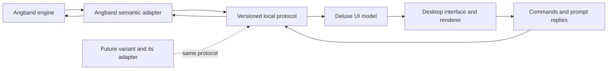

# Angband Deluxe: product and implementation specification

Status: target design. A first Windows development build now implements a subset;
see [implementation status](../deluxe/README.md) and [development protocol 0.1](deluxe-protocol-0.1.md).
Prepared 21 September 2026 from the project brief and the complete conversation
"Enhanced Angband Client Search". The current brief takes precedence over earlier
ideas in that conversation. Aesthetic overhaul is a later phase.

## 1. Product intent

Angband Deluxe is a Windows, macOS and Linux desktop front-end for Angband and,
eventually, other Angband variants that implement the same semantic API. Angband
continues to own the rules, simulation, character progression, randomness,
knowledge, command execution and save format. Deluxe makes existing information
and commands easier to use and understand.

The fork exists to add an adapter and front-end integration points. Do not rewrite
or redesign the core library. Prefer existing hooks; any indispensable new hook
must be a small, behaviour-preserving change with parity tests. Gameplay changes
are outside this project, even when they appear convenient for the new interface.

The intended compatibility promise is: install a compatible backend package for
the current operating system, select it in Deluxe, and play without rebuilding or
changing Deluxe. An arbitrary existing Angband executable does not automatically
implement this contract. Saves remain specific to their engine and version.

## 2. Non-negotiable requirements

1. The same engine build, starting state, RNG state and player actions produce
   the same gameplay outcomes through the classic and Deluxe interfaces.
2. API queries, tooltips, sorting, resizing and rendering consume no game time,
   change no knowledge, use no gameplay RNG and never mutate the live simulation.
3. The backend may expose actual engine state, including information hidden from
   the player. Player knowledge is metadata, not an API access restriction.
   The front-end decides which information to display or use for presentation.
4. All gameplay actions pass through the engine's existing command handling,
   including costs, restrictions, inscriptions, confirmations and interruptions.
5. Keyboard play remains fast and complete. Mouse and controller actions use the
   same semantic commands. Cosmetic animation never gates the next input.
6. Engine-specific rules and calculations stay in the backend adapter. The client
   consumes data, descriptions, capabilities and action descriptors.
7. The existing front-ends and native savefiles remain usable. Deluxe settings
   and supplementary history are stored separately from engine saves.

Actual state, player-known state, remembered observations and current perception
are distinct. A bonus unknown to the character may still have an exact value in
the API. Reading that value must not identify the item in the simulation.
Unavailable to the adapter and unknown to the player are also distinct states.

## 3. Architecture

### Backend boundary

Use one child process per active game, communicating over standard input/output
with a versioned, UTF-8 JSON Lines protocol. Standard error carries diagnostic
output. No network listener or service is required. This avoids exposing native
struct layouts, pointers, compiler ABIs or the engine's global state to Deluxe.
It also lets a variant implement the contract in its own language and build.

The first backend lives in this repository and links the existing C engine.
Keep serialization and transport separate from the semantic adapter so
both can be tested independently. An in-process interface can be added later;
it is not the compatibility contract.

Keep simulation on a single engine thread. Input hooks can block that thread
while awaiting a protocol reply, while the separate client remains responsive.
Queries during a prompt read immutable published snapshots. No background thread
may call arbitrary engine functions or inspect mutable globals.

### Client boundary

Separate connection/package handling, semantic models, commands, widgets and
rendering. Client production code must not include Angband engine headers or
assume its inventory size, equipment slots, class list, stat count, depth units,
spell system, damage formula or enum ordinals.

A C++ desktop client using SDL3 is the preferred starting point, with a plain
glyph renderer first. SDL GPU is a candidate for the later effects renderer;
Dear ImGui is a candidate for the initial panels. These are implementation
preferences subject to a small desktop/accessibility spike, not API dependencies.
SDL documents its GPU abstraction and Dear ImGui supplies SDL3/SDL GPU backends:
[SDL GPU](https://wiki.libsdl.org/SDL3/CategoryGPU),
[Dear ImGui backends](https://github.com/ocornut/imgui/blob/master/docs/BACKENDS.md).
Backend availability alone does not establish screen-reader support or complete
desktop usability; test those separately before committing to the widget layer.

## 4. Information availability and presentation

The API is permitted to expose hidden information without requiring an inspection,
pickup, identification or other player action first. This applies generally, not
only to facts available through a free look action. No per-field exception or
special spoiler/debug mode is required merely because a fact is hidden.

Expose actual values alongside player-knowledge and perception metadata, with
separate observed/remembered values where they differ. The front-end can then
choose how to use them. Transporting information does not itself require Deluxe
to show it, and future uses need not be anticipated before allowing API access.

| Domain | API may expose | Useful accompanying context |
| --- | --- | --- |
| Player | Actual stats, equipment contributions and status durations | Character-screen values and learned sources |
| Items | True identity, curse/artifact/ego status, value and modifiers | Known identity/properties, appearance and current visibility |
| Monsters | True race, exact HP, abilities and actual position | Perceived identity, visibility, displayed health band and learned recall |
| Map | Actual terrain, hidden traps, secret doors and unseen occupants | Explored/remembered terrain, detection and perception |
| Spells | Engine effect parameters and actual-state calculations | Player-facing descriptions and calculation assumptions |
| Events | Full paths, areas, source/target identities and resolved damage | Which segments and participants were perceived |
| History | Actual events and identities, including previously hidden facts | What was known at the event and what was learned later |

For example, the backend may expose that a floor item is cursed before the player
has looked at or picked it up. Deluxe may use that value for a curse effect. The
API need not establish that a free inspection would already reveal it. This does
not mark the item as identified, execute look/pickup or change any item mechanics.

Hallucination, blindness, mimics and detection still need accurate metadata so the
client can distinguish actual state from perceived appearance. Exact monster HP,
unidentified properties and unseen geometry are all legitimate API data; their
on-screen use is a front-end product choice, not a protocol prohibition.

The initial ordinary panels can retain familiar player-known views. Deliberate
uses of additional information, including visual effects, remain supported.
Choosing those views does not impose filtering on other API consumers or require
them to use the same disclosure policy. API completeness can grow incrementally;
permission to expose data is not a requirement to serialize the entire engine.

Previews declare whether they use actual or player-known state, and distinguish
calculated estimates from resolved outcomes. Queries must not advance the live
simulation or consume its RNG to determine future results. Unchanged gameplay
means unchanged rules and simulation for equal actions; it does not require equal
information presentation or imply that richer presentation cannot help decisions.

## 5. Quality-of-life requirements

The following are product scope. Milestones sequence delivery; they do not
silently drop features. Each feature is enabled only when its backend capability
is present. Disabled features have an understandable explanation.

| Feature | Required behaviour | Acceptance condition |
| --- | --- | --- |
| Inventory, equipment and quiver | Search/filter/sort views, clear backend-defined slots, keyboard selection, context actions; optional drag/drop maps to wield/takeoff/drop | Sorting changes only the view; a selected item remains correct after reorder; confirmations and turn costs match classic play |
| Item comparison | Compare a candidate against an explicitly chosen occupied slot; damage, stats, speed, resistances and effects with an explicit calculation basis | Comparison changes no live equipment, RNG, engine knowledge or turn; two rings and multi-slot replacements are unambiguous |
| Rich inspection | Hover, focus or select items, monsters, terrain, spells and statuses for descriptions and properties | All inspection works without a mouse; the client chooses which actual and observed properties to present |
| Character dashboard | Resources, stats, armour, speed, depth, statuses, resistances and sources | Familiar values match character screens; additional actual-state details remain distinguishable |
| Targeting | Target cycling, mouse selection, trajectories/range, beam and area previews where supported | Actual targeting uses engine rules; previews declare actual/known-state basis and do not claim random outcomes are certain |
| Knowledge browser | Search and filter monsters, uniques, objects, artifacts, egos, runes, spells and discoveries | The initial learned-information view filters results, counts and sort keys consistently; the API can also supply undiscovered records |
| Message history | Scroll/search/filter, engine message categories, repeat counts, warning emphasis, sequence and known turn labels | Critical engine acknowledgements remain required; old messages without known turns are labelled as such; no fabricated timestamps |
| Command palette | Search named commands and applicable items/spells, then collect required arguments | "Cast phase door" resolves an available spell and follows ordinary validation; ambiguous matches require selection |
| Keybindings and macros | Searchable configuration, context-aware conflicts, classic and roguelike presets, import/export, profiles | Equivalent commands produce equivalent actions; macros retain engine interruption and confirmation behaviour |
| Context actions | Applicable commands on objects, creatures, doors and stairs | The client chooses which supplied details to show; commands still undergo normal engine validation |
| Character creation | Data-driven race/class/stat selection, explanations, consequences and keyboard navigation | Uses existing birth commands, restrictions and random rolls; inspecting an option never rerolls |
| Stores and other selections | Search/sort stock and options, clear quantities/prices, keyboard navigation | Engine validates price, stock and affordability at execution; stale selection cannot buy another object |
| Map and minimap | Known-map view with optional stairs, objects, traps and creature layers | The initial known-map view uses observation data; actual-state data remains available for other presentation uses; level changes invalidate old data |
| Accessibility | Scalable UI/fonts, high contrast, non-colour cues, reduced motion, remapping and visible keyboard focus | Core flow is keyboard complete and usable at 200% scaling; screen-reader feasibility is tested before claiming support |
| Saves and profiles | Character selection, backend/version labels, save metadata, settings profiles, optional captured thumbnails | Saves are routed only to compatible engines; import does not overwrite the original; sidecars cannot alter gameplay state |
| Run history | Milestones, uniques, artifacts, depth progression, equipment changes and death/victory summary | Distinguish actual events from what the player knew; older runs may have incomplete history; sidecar loss does not prevent loading the native save |
| Mouse/controller | Point/select/context actions and remappable controller navigation | Neither is required; focus and menu transitions cannot accidentally spend a turn |
| Presentation settings | Font/UI scale, ASCII/tile choice where assets exist, sound volume/mute, animation speed including instant | Settings do not change engine timing or decisions; animations can be skipped without swallowing the triggering command |

Inventory filters follow the chosen front-end view. Context menus are conveniences, not a
replacement rules engine: attempting a generally available action can still
fail normally and spend a turn when the engine's rules require it.

No new automatic tactical decisions, engine-side auto-identification, auto-healing,
auto-equipping, pathfinding advantages, difficulty changes or altered generation
are part of this specification. Existing engine automation may be exposed as
existing commands with its existing stop conditions.

### Deferred presentation and optional extensions

Particles, glows, lighting, CRT/scanlines, animated creatures, fancy transitions,
spatial ambience, theme packs and new art belong to the aesthetic phase. Reserve
semantic event support for them now; do not implement their effects first.
Cloud synchronization, deterministic replay, web/mobile clients and a general
mod marketplace are separate future projects. Screen-reader support is a desired
outcome, gated by real assistive-technology validation rather than a toolkit claim.

## 6. Variant installation and compatibility

A backend package contains a manifest, a platform-native executable, its runtime
dependencies, game data, licences and optional presentation assets. The manifest
declares stable engine identity, engine version, protocol ranges, package format,
platform/architecture, launch path and save compatibility identifier. Executable
and asset paths are relative to the package; extraction rejects traversal paths.

Dragging a package or selecting a folder registers it. Registration reads metadata
without running the engine. Selecting Play launches that engine and negotiates
the actual capabilities; the manifest is not a substitute for the handshake.
Import, version mismatch, missing dependency and startup failure produce useful
messages. Packages are executable software; process separation is not a sandbox.

Keep saves, settings and history in writable user directories, namespaced by
engine identity and save compatibility. Never write runtime data into installed
application bundles. Updating a package must not replace active-game binaries or
silently migrate saves. Multiple installed versions can coexist.

The first conforming implementation is this Angband fork. A second, deliberately
different mock backend must demonstrate unusual slots/stats/commands and missing
optional capabilities without any engine-specific client patches. A real second
variant is a later integration, not a launch prerequisite or an implied commitment
to modify FrogComposband or ZAngband now.

## 7. Repository integration findings

Inspected baseline: `167ba295d8ed2971aa53891cea0d9cf2a92c6333`, labelled Angband
4.2.6 by the README. This fork already includes commands such as explore and
navigation. Do not equate its README version with proof of upstream gameplay
identity. Parity first means this exact engine with and without the adapter;
audit pre-existing differences separately before advertising vanilla equivalence.

| Existing integration surface | Intended use and caution |
| --- | --- |
| `src/game-event.h` | Subscribe to state invalidations, lifecycle and effects; copy pointer-backed payloads and preserve perception metadata |
| `src/cmd-core.h` | Translate public command IDs and arguments into the existing queue; do not expose internal enum ordinals |
| `src/game-input.h` | Bridge item/spell/direction/quantity/text/check requests into correlated prompts without rewriting command implementations |
| `src/player.h` | Map actual and knowledge-aware state into distinct semantic values |
| `src/cave-map.c` | Study existing visibility/memory rules; `map_info()` can memorize squares and consume RNG during hallucination, so it is not a pure query |
| `src/ui-display.c` | Reference health bars and visible status semantics alongside exact engine values |
| `src/obj-info.h` | Reuse pure descriptions/calculations; label player-known, actual and template data distinctly |
| `src/player-calcs.c` | Support known-only and actual-state comparisons; prove purity and use isolated hypothetical state |
| `src/player-history.h` | Export actual identities with known-event flags and discovery timing |
| `CMakeLists.txt`, `src/tests/` | Add optional backend/client targets and adapter tests while preserving existing builds |

Audit each reused helper for mutation, RNG consumption and actual/known semantics.
Do not solve comparison by temporarily swapping the live equipment or solve map
queries by repeatedly driving the terminal renderer. Capture an existing
presentation result where appropriate, or extract a demonstrably pure helper.
Fallback terminal frames can preserve unusual menus during development; semantic
widgets must never derive their data by parsing those frames.

## 8. Delivery sequence and release gates

### M0: contract and feasibility

Finalize the companion protocol design, field-level provenance and fixtures.
Prototype process launch and one round-trip on all three operating systems.
Test UI scaling, keyboard focus, text input and assistive-technology options.
Inventory helpers that need new pure accessors. Record a clean baseline build.

Exit: a written contract, executable protocol fixtures, a mock backend and a
chosen client stack. These are design/transport tools, not a playable release.

### M1: first playable API-backed client

Implement backend handshake, lifecycle, immutable snapshots, commands, prompts,
save/load and terminal fallback. Deliver a plain dungeon view with character,
inventory/equipment, messages and known-monster inspection panels. Add basic
palette search, context actions, scaling and keyboard configuration.

Exit: create a character, enter town/dungeon, move, fight, use items, handle a
prompt, save, close and reload through Deluxe on Windows/macOS/Linux. Demonstrate
actual/known-state separation and parity for these flows. Label remaining fallback menus.

### M2: complete semantic QoL

Add comparison, targeting previews, knowledge browser, native birth/store/spell
and item selection, minimap, advanced bindings/macros, profile/save management
and run reports. Complete mouse support and controller navigation. Remove reliance
on fallback menus for the standard supported Angband play flow.

Exit: every QoL row above has its acceptance checks, or an explicit backend
capability limitation visible in the UI. Unsupported advertised capabilities
are defects, not a reason to leave a button inert.

### M3: compatibility and distribution

Publish the adapter guide and conformance suite; exercise the alternate mock
backend. Package and smoke-test releases on Windows, macOS and Linux, with
spaces/non-ASCII characters in installation and save paths. Test package upgrades,
missing assets, incompatible saves and a backend crash. Retest classic front-ends.

Exit: installable packages, tested platform matrix, dependency/licence inventory,
versioned contract and accurate feature/support documentation. Operating-system
minimums and supported CPU architectures are set from tested builds, not guessed.

### M4: aesthetic overhaul

Use the semantic state, perception metadata and events for the visual/audio treatment discussed
in the original chat. Art direction is intentionally left open for the next brief.

## 9. Validation strategy

- **Gameplay parity:** replay equal semantic actions against equal initial game
  and RNG states using classic-input and API-input paths. Compare normalized
  simulation state, RNG state, turn/energy, inventory, outcomes and saves. Exclude
  wall-clock metadata, but do not ignore gameplay differences as "UI effects".
- **Read purity:** repeat all queries, comparisons and previews; open/close panels,
  filter and resize; assert no change to simulation, knowledge, RNG or energy.
  Include hallucination and failed/invalid queries.
- **Actual/known-state separation:** paired fixtures differ only in hidden facts;
  actual-state outputs reflect the difference while player-known views remain
  accurate to their stated basis. Include curses, mimics, invisible monsters,
  hidden walls/traps and remembered locations. Verify a curse effect can use an
  uninspected item's actual value without changing engine identification state.
- **Command parity:** confirmations, inscriptions, cancellations, failed actions,
  rest/run interruptions, repeated commands, full inventory and stale handles.
- **Transport:** negotiation mismatch, malformed/oversized frames, duplicate
  request IDs, broken pipes, lost delta revisions and child termination.
- **Compatibility:** unknown optional fields, absent capabilities, different
  equipment layouts and namespaced custom actions on the mock backend.
- **Desktop QA:** complete keyboard and mouse flows on all three OSes; 200% UI
  scaling, high contrast, reduced motion, focus restoration and controller input.
- **Responsiveness:** on a declared reference machine, target cached UI response
  within 50 ms and local protocol overhead below 20 ms at the 95th percentile,
  excluding engine processing. Measure before fixing a release performance bar.

Conformance checks data semantics, provenance and non-mutating reads; it does not
require concealing hidden engine state. Native package tests cannot be replaced
by a successful Windows build alone.

## 10. Decisions still to resolve during implementation

The product boundary, cross-platform requirement, unrestricted information access and
unchanged gameplay are fixed requirements. These implementation details need
evidence from M0: widget toolkit/accessibility integration, minimum OS/GPU targets,
how much terminal fallback is needed, pure comparison accessors, known-map preview
support and packaging/signing tooling. None requires a change to game balance.

The protocol and backend compatibility details are specified in
[the companion API design](deluxe-api.md).
